# 概述

## 地址映射

静态地址映射
动态地址映射

## 主存分配

数据结构：
1.等待队列
2.空闲区队列
3.主存分配程序

策略：
1.分配：如何选择一个请求者
2.放置：如何选择一个空闲区
3.调入：什么时候装入
4.淘汰：如何选择该清空的内存区

## 主存扩充

程序局部性原理：
程序在执行过程中的一个较短时间内，所执行的指令地址或操作数地址分别局限于一定的存储区域中。

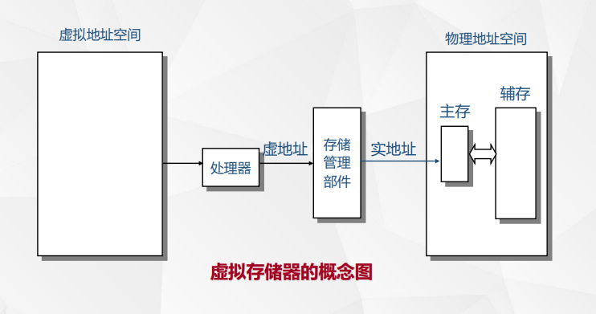

## 存储保护

## 界地址保护

上下界防护：上、下界寄存器

基地址、限长防护：基址寄存器、限长寄存器

## 存储键保护

为每个进程的连续存储区域分配一个若干位组成的存储保护键（钥匙）。

# 分区存储管理
## 分区方式
### 静态分区

维护一个分区说明表：
记录分区信息的数据结构。存储管理程序在内存分配、释放、存储保护以及地址转换时都要查询和修改分区说明表中的信息。

### 动态分区

分区分配数据结构：
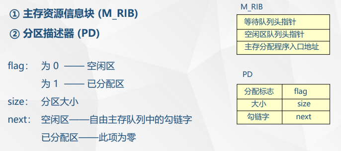
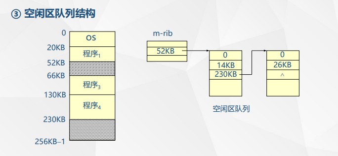

分区分配思路：

分区回收思路：

## 放置策略

### 首次适应算法：
从低往高放
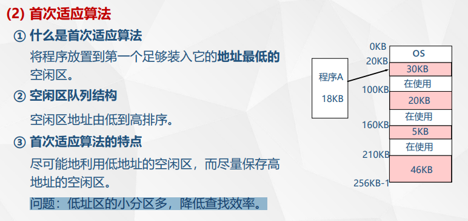

### 最佳适应算法：
选大小最接近的
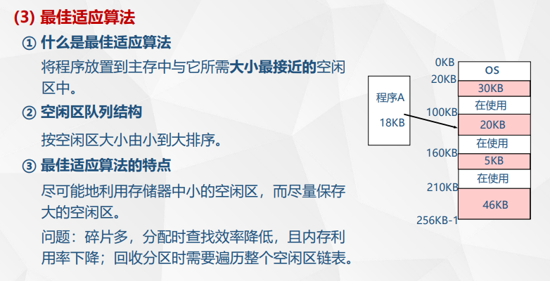

### 最坏适应算法
选大小差的最远的
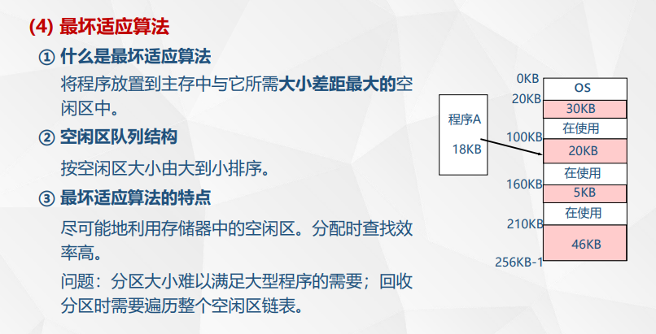

### 拼接技术
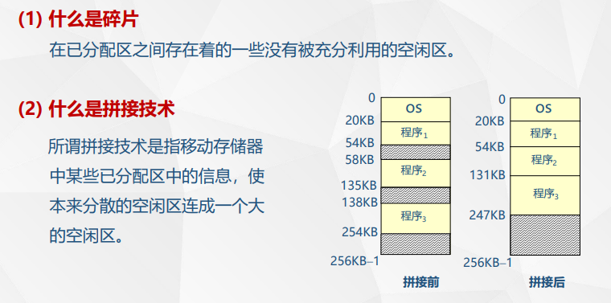

# 页式存储管理
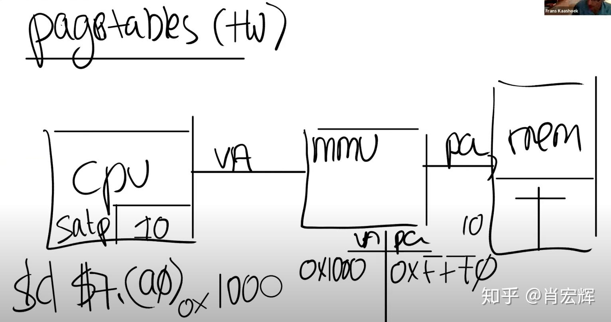

## 单位
1KB = 1024bytes = 2^10bytes
1MB = 1024KB
1GB = 1024MB

## 页
虚拟内存的单元，通过页表映射到块。

CPU给出地址的前几位。

## 块
内存被分割为块，一块有固定的大小，块是连续的。

## SATP寄存器
保存page table在内存中的位置，由内核所中的数据结构所维护。

## MMU
并不保存page table，而是根据SATP从内存中读取page table，然后完成翻译。

## 页表
页到块的映射关系。

### PTE
页表项

### PDE
多级页表的页目录

### 与应用进程的一一对应
每个应用程序都有自己独立的表单，并且这个表单定义了应用程序的地址空间。
所以当操作系统将CPU从一个应用程序切换到另一个应用程序时，同时也需要切换SATP寄存器中的内容，从而指向新的进程保存在物理内存中的地址对应表单。
这样的话，程序1和程序2中相同的虚拟内存地址，就可以翻译到不同的物理内存地址，因为每个应用程序都有属于自己的不同的地址对应表单。

### 使用联想存储器加快查表速度

在联想存储器中存放正在运行的进程当前用到的页号和对应的块号，又称为快表。

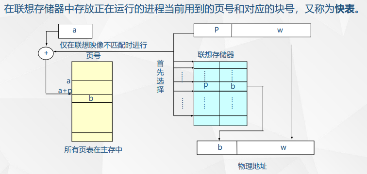

改进后速度计算：

1.慢表：

两次访问主存（一次查表，一次取数）

2.快表：

见图

### 多级页表（二级）
存储代价换取更快的查找速度。

31-22：一级页号

21-12：二级页号

11-0：三级页号

### 请求页式系统
#### 扩充页表项
页号：

主存块号：

中断位：标识是否在主存

辅存地址：表示该页面在辅存的位置

引用位：标识该页最近是否被访问

为“0”—— 该页没有被访问；

为“1”—— 该页已被访问

改变位：表示该页是否被修改

为“0”—— 该页未被修改；

为“1”—— 该页已被修改

#### 淘汰策略
##### OPT算法
理想算法，衡量标准
##### FIFO算法
用指针维护页面进入先后次序的队列
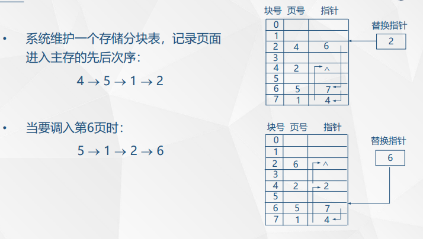
##### LRU算法 最久未被使用淘汰
###### 硬件实现
采用时钟计数器，在页表中增加“最后访问时间”字段
###### 软件实现
维护一个栈，栈底是最久未被访问的，栈顶是刚被访问的
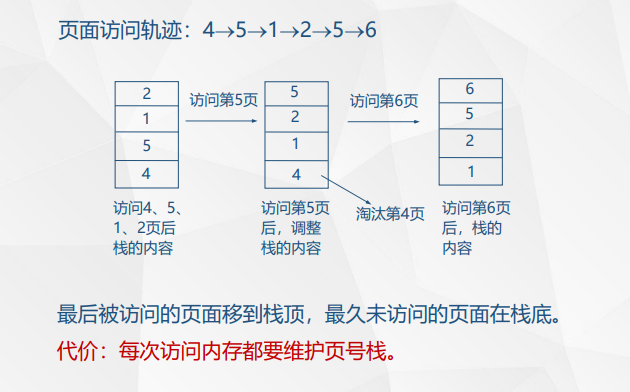
##### LRU近似淘汰算法
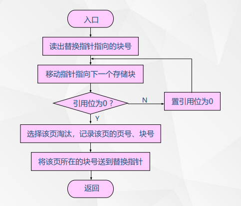
维护一个替换指针，按照一定方式更改指针并找到合适的块（每次开始前，指针指向的是上一次填入的块号）
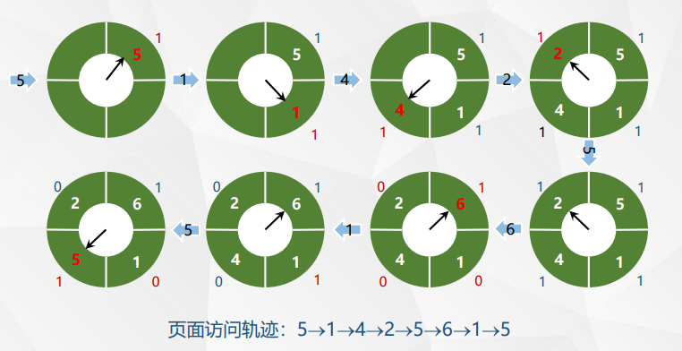
##### 各种算法示例
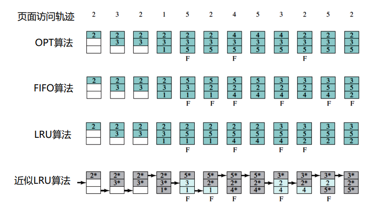
# 段页式存储管理
## 段式
指令：s（段号）+w（段内位移）

段表项：段号+长度+物理基址

流程：
    取出程序地址(s，w)；

    用s检索段表；

    如w＜0或w≥L则主存越界；

    (B＋w)即为所需主存地址
## 区别
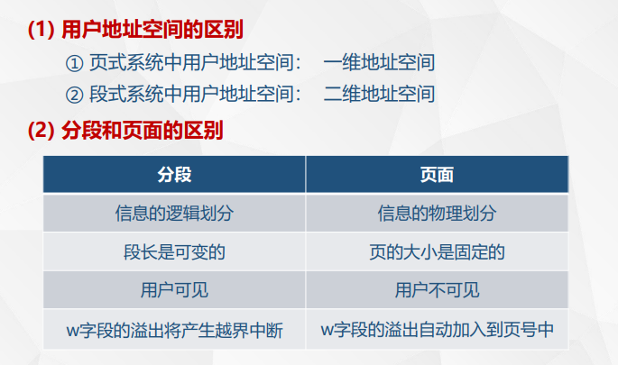
## 段页式
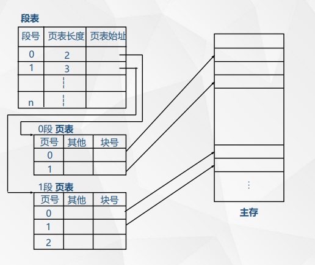

