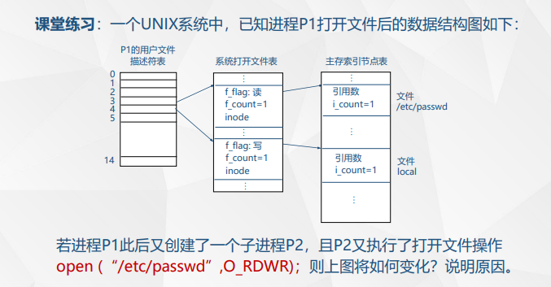
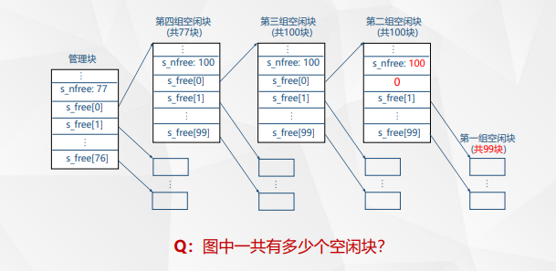

# 文件
文件是在逻辑上具有完整意义的信息集合，它有一个名字以供标识，文件名是有若干约束的字符串。

## 文件的特点
长期保存，进程间共享，有内部结构

## 文件的基本单位
信息项（单个字节或字符）、记录

## 文件的分类


## 文件名和属性
文件名+文件拓展名

文件属性：

表示文件类别、保护级等信息

# 文件系统
文件系统是操作系统中负责管理和存取文件信息的软件机构

## 文件系统的组成


## 文件系统的功能

## 文件系统的结构
### 逻辑结构
#### 流式文件

#### 记录式文件

### 物理结构
#### 连续文件


#### 串联文件


连续快，随机慢
#### 文件映照(FAT)


##### FAT例子


#### 索引文件


##### 直接索引


##### 一级间接索引


# 文件存储空间的管理
## 位示图法
## 空闲文件目录

## 空闲块链

# 文件目录结构
## 文件控制块 FCB
文件控制PCB块，为每个文件建立的唯一的管理数据结构


## FCB和文件目录
文件目录由FCB组成，其中包含两种FCB：

1.普通文件的FCB

2.子目录的目录文件的FCB(目录文件包含)

### 例子
``````
/home/users/
|-- file1.txt
|-- file2.doc
|-- my_documents/
    |-- file3.txt
``````
### 纯树形结构


### DAG目录结构


# 文件共享和安全


保护：

检查用户权限

## 链接技术
在相应目录表目之间进行链接，即个目录中的表目直接指向另一个目录表目所在的物理位置


### 硬链接
    ln /data/ln/src /data/ln/dst

两项条目指向同一个inode（有一个inode，引用计数为2）


### 软连接
    ln -s /data/ln/src /data/ln/dst

一个inode指向另一个条目（有两个inode，引用计数都为1）


#### 硬链接与软链接的区别

硬链接不能连接目录文件；软连接可以

硬链接只能链接本文件系统内的；软链接可以连接外的

删除源文件（注意是源文件）后，硬链接还能用；软连接会失效

# 文件操作
## 打开和关闭
open close

打开文件：
把该文件的有关目录表目复制到主存中约定的区域，建立文件控制块，建立用户和这个文件的联系

关闭文件：
用户宣布这个文件当前不再使用，系统将其在主存中的文件控制块删去，因而也就切断了用户同这个文件的联系

# unix文件系统
## 文件类型


## 索引文件结构


superblock - inode - data

### inode


包含地址索引表

### 地址索引表
#### 小型文件 直接索引


#### 大型文件 一级间接索引

简介索引块有256项

7*256*512B

#### 巨型文件

最后一个条目用来进行二级索引

7*256*512B+1*256*256*512B

#### system V
一块为1KB = 1024B
10*1KB + 1*256*1KB + 1*256*256*1KB + 1*256*256*256*1KB
### 目录文件和目录项
目录项：16位inode序号＋文件名

根目录文件inode为固定1号
### 文件系统查找+读取+打开举例


#### 查找
/ inode为1号，地址1001

看查1001数据区，找到目录项<inode=4 filename=a>

/a inode为4号，地址为1008

...
#### 读取

#### 打开


##### 活动i节点表
主存中的数据结构

当执行打开文件操作时，将文件辅存inode的有关信息拷贝到主存，形成活动inode（主存索引节点），若干个活动inode组成活动inode表。


##### 系统打开文件表

##### 用户文件描述符表
PCB中的一个数组，每一项都指向一个系统打开文件表的表项，再指到主存inode

PCB用户文件描述符表 -> 系统打开文件表 -> 主存inode表

##### 父子进程的打开文件
子进程继承父进程的用户文件描述符表，并将系统打开文件表中对应的f_count+1（注意到i_count并不改变，只有当执行open函数时才会将i_count++）。故子进程可以直接用父进程打开的文件指针
###### 例子


## 空闲块的管理


### 管理块数据结构


### 成组链接法


共77+100*3个空闲块

### 块的分配

#### 当管理块栈底的组有多于一个空闲块时
直接从栈顶拿走，更新管理快的s_free和s_nfree

#### 当管理块栈底的组仅一个空闲块的时候
记下这个空闲块的内容，填入管理块；

将闲置出来的空闲块分配出去，这一组全部完成分配

### 块的回收
#### 当管理块栈中少于100个空闲块
直接放入栈顶，更新管理快的s_free和s_nfree

#### 当管理块栈中有100个空闲块

#### 例子


(1) 302个
(2) 
