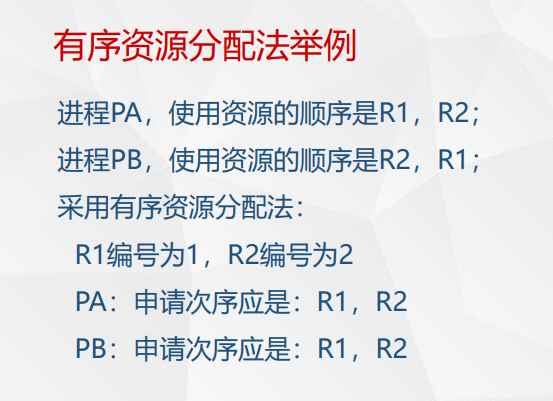

# 资源管理概述
## 资源管理目标
保证高资源利用率

对不共享资源实现互斥

防止死锁
## 资源管理功能
### 资源管理使用的数据结构
资源的物理名，逻辑名，类型，地址，分配状态

### 资源管理分配原则
分给谁，何时分配，分配多少

#### 静态分配
系统对作业进行静态资源分配

调度作业时，根据作业所需资源进行分配；并在作业运行完毕时，收回所分配的全部资源。这种分配通常称为资源的静态分配

#### 动态分配
系统对进程进行动态资源分配

进程运行中，根据进程提出的资源需求，进行资源的动态分配和回收。这种分配通常称为资源的动态分配

#### 虚拟资源和实资源

例子：

处理机 - CPU - 进程 - 进程调度

存储器 - 主存 - 虚存 - 地址映射

设备 - 外部设备 - 逻辑设备/虚拟设备 - 设备分配/动态映射

信息 - 物理文件 - 逻辑文件 - 磁盘空间分配/文件目录查找

### 资源管理实施
分配和回收

### 对资源的存取控制和安全保护
对资源的存取进行控制并对资源实施安全保护措施

# 资源分配机构和策略
## 资源描述器
### 定义
描述各类资源的最小分配单位的数据结构称为资源描述器。

比如对于主存分区分配中，最小分配单位为主存分区

### 内容

## 资源信息块
描述某类资源的请求者、可用资源和资源分配程序等必要信息的数据结构

例子：

## 资源分配策略
先请求先服务：

维护队列

优先调度：

为每个请求维护一个优先级，按优先级排序

# 死锁
两个进程相互占有对方正在等待的资源

1等2放 2等3放 3等4放

## 例子1
进程p1 p2

打印机r1

输出机r2

信号灯s1 s2

申请p

释放v

2号可能死锁

## 例子2

生产者先请求缓冲区操作权，再等待empty

消费者无法得到操作区使用权，无法empty

## 例子3

## 进程-资源分配图
请求边：进程->资源

分配边：资源->进程

## 解决方法
### 静态分配策略

破坏互斥条件

缺点：

难实现，资源浪费
### 有序资源分配
每个资源定一个唯一编号，

分配请求必须以上升次序进行。

### 银行家算法

结构：

    max 每个进程最多需要(max = allocation + need)

    allocation 进程目前占有

    need 当前时刻需要

    available 系统有多少可供分配

算法：

    对于每一次支出，先检查request是否<=need,是否<=available;

    再使用银行家二级算法检查支出后系统是否处于安全状态：

    若安全，批准；否则不批准

#### 检查系统是否处于安全状态

#### 例子

## 死锁的解除

