# 进程
从定义来说：进程是指一个具有一定独立功能的程序关于某个数据集合的一次运行活动。

从具体实现来说：进程 = 程序与数据 + PCB进程控制块
## 三个基本状态
### 运行状态
该进程已获得运行所必需的资源，它的程序正在处理机上执行。
### 等待状态
进程正等待着某一事件的发生而暂时停止执行（如IO输入）。这时，即使给它CPU控制权，它也无法执行。
### 就绪状态
进程已获得除CPU之外的运行所必需的资源，一旦得到CPU控制权，立即可以运行。
### 转化关系
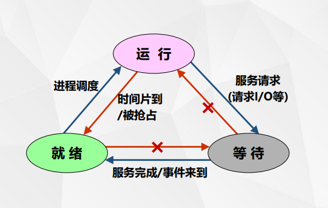
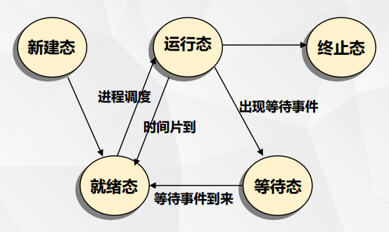
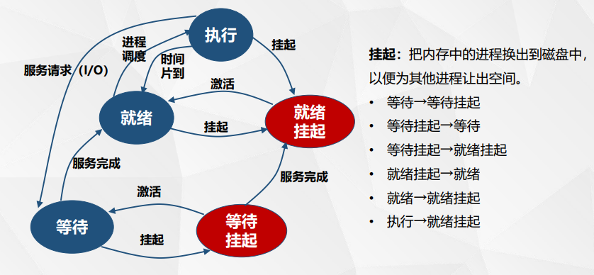

（挂起是将内存中的程序载入外存中）
### 进程控制块
定义：
    描述进程与其他进程、系统资源的关系以及进程在各个不同时期所处的状态的数据结构，称为进程控制块 (process control block，PCB)。

实现：
    进程标识符：符号名或ID号

    进程当前状态

    当前队列指针next：维护同状态的进程链表

    进程优先级：反映了进程要求CPU的紧迫程度

    CPU现场保护区：当进程由于某种原因释放处理机时，CPU现场信息被保存在PCB的该区域中（process->trapeframe）

    通信信息：进程间进行通信时所记录的有关信息

    家族联系：指明本进程与家族的联系

    占有资源清单

linux下的例子：
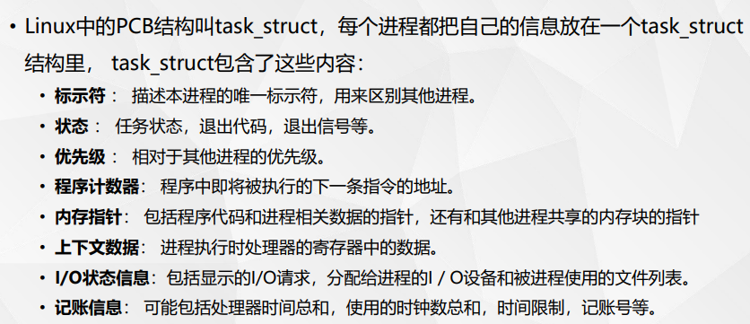

# 进程控制

## 进程控制原语

### 进程创建原语

创建一个具有指定标识符的进程，建立进程的PCB结构

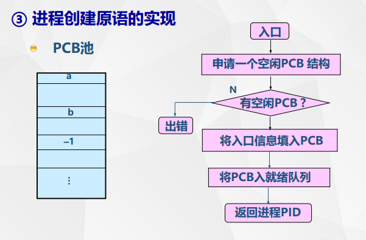

#### linux fork
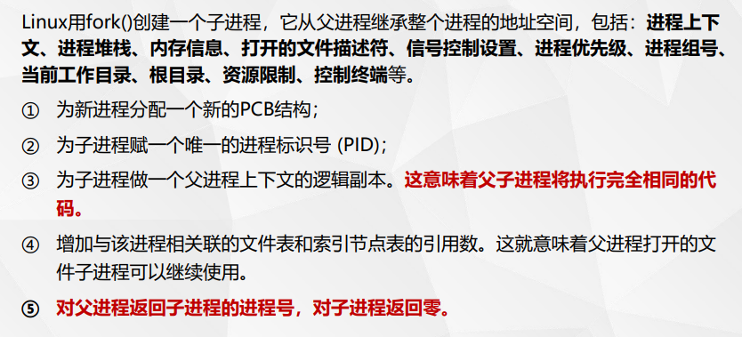
1.执行相同代码,但注意：子进程从父进程fork的那行代码开始执行

2.父进程返回PID，子进程返回0

eg:
    main(){
        int pid1, pid2;
        pid1=fork();
        pid2=fork();
        printf(“pid1=%d\n”, pid1);
        printf(“pid2=%d\n”, pid2);
    }

测试代码：
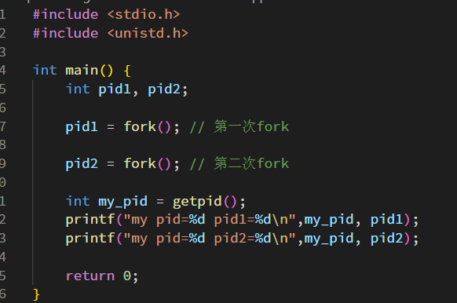

运行结果：
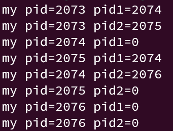

解释：

2073创建2074进程，2075进程

2074从fork1开始执行，fork1返回0，pid1为0；fork2返回2076，pid2为2076

2076从fork2开始执行，pid1继承2074号进程的上下文，为0；fork2返回0

2075从fork2开始执行，pid1继承2073号进程的上下文，为2074；fork2返回0，故pid2为0

一共四个进程，打印八行
#### linux exec
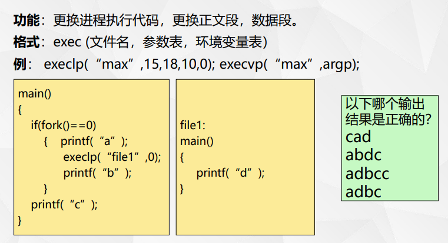

cad
### 进程撤销原语
功能：撤消当前运行的进程。将该进程的PCB结构归还到PCB资源池，所占用
的资源归还给父进程，从总链队列中摘除它，然后转进程调度程序。

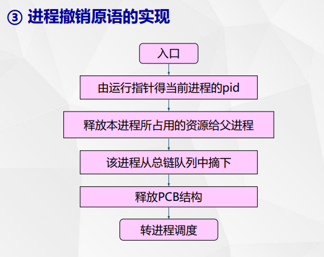

撤销原因：

#### linux exit
停止进程运行，清除内存空间，销毁数据结构；但保留了其PCB结构，等待父进程来回收

进程变为zombie态，若其父进程正在等待它的终止，则父进程可立即得到其返回的整数status

##### 僵尸进程
若子进程调用exit()，而父进程并没有调用wait()或waitpid()获取子进程的状态信
息，那么子进程的PCB仍然保存在系统中。这种进程称之为僵尸进程。

##### 孤儿进程
当一个父进程由于正常完成工作而退出或由于其他情况被终止，它的一个或多个子进
程却还在运行，那么那些子进程将成为孤儿进程。

将被1号进程接管，一号进程定期清除僵尸进程

### 进程等待原语
susp(chan)

chan:进程等待的原因

功能：

中止调用进程的执行，并加入到等待chan的等待队列中；最后使控制转向进程调度。

实现：

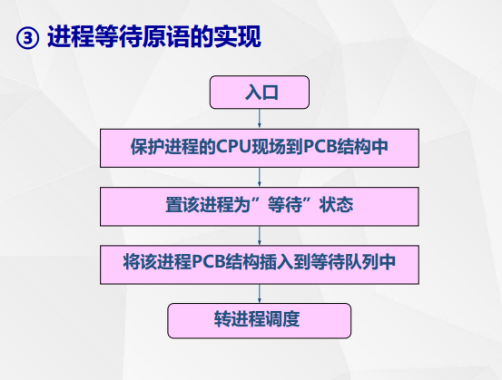

#### linux wait
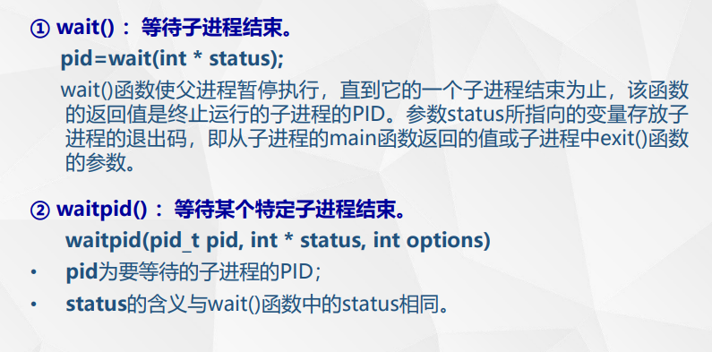

#### wait 和 exit 例子
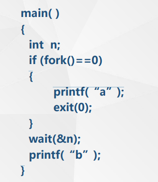

a -> b

### 进程唤醒原语
wakeup(chan)

入口参数chan：进程等待的原因

功能：

当处于等待状态的进程所期待的事件来到时，由发现者进程使用唤醒原语唤醒它。

实现：

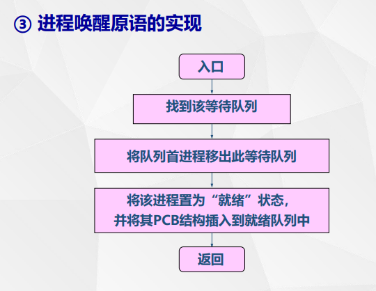
# 进程切换
什么时候进行进程切换？

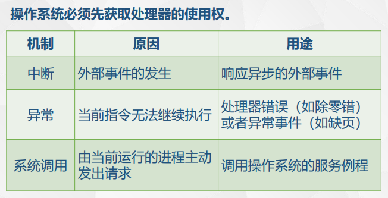

操作系统获得了处理器使用权后，一定会做进程切换吗？

进程切换要做哪些事情？

保存上下文；切换上下文
# 进程之间的制约关系
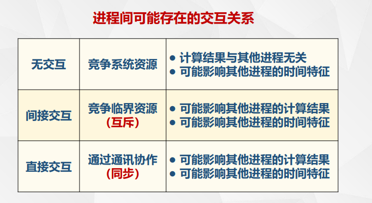

## 进程互斥
### 临界资源
一次仅允许一个进程使用的资源称为临界资源。
### 临界区
进程中对公共变量 (或存储区)进行审查与修改的程序段，称为相对于该公共变量的临界区。
### 互斥
操作系统中，当某进程正在访问某一存储区域时，就不允许其他进程来读出或者修改该存储区的内容，否则，就会发生后果无法估计的错误。进程间的这种相互制约关系称为互斥。

## 进程同步
并发进程在一些关键点上可能需要互相等待与互通消息，这种相互制约的等待与互通消息称为进程同步。

### 进程同步的例子
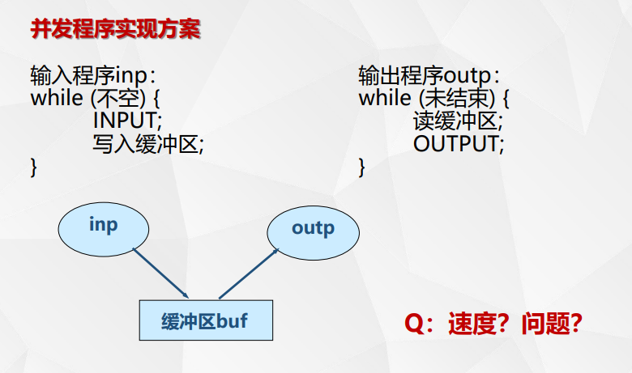